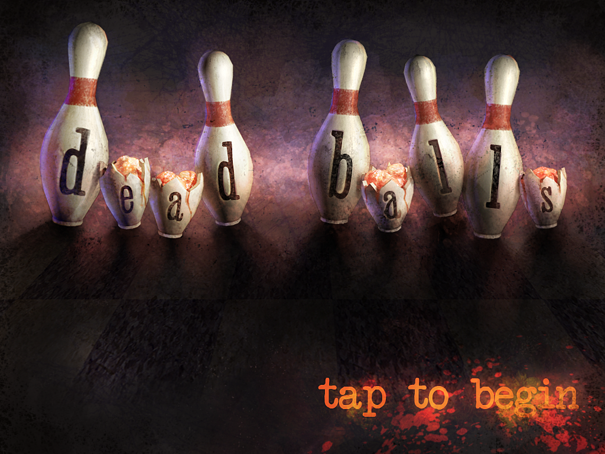
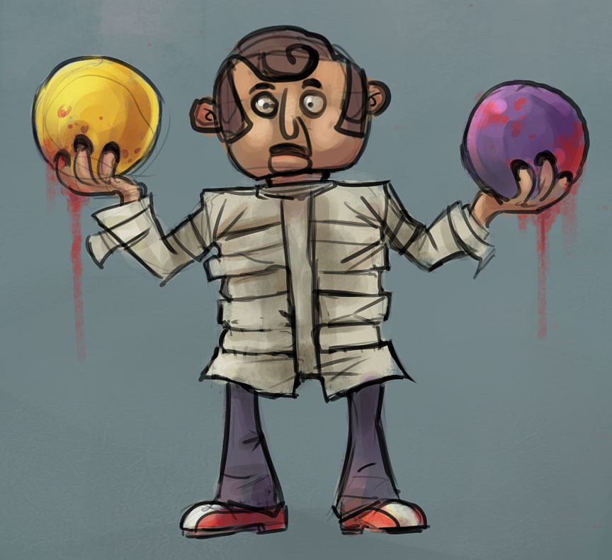
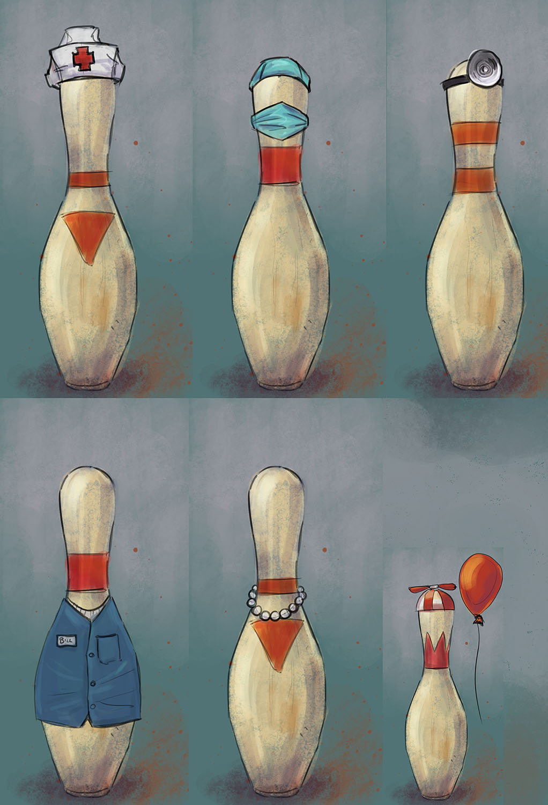
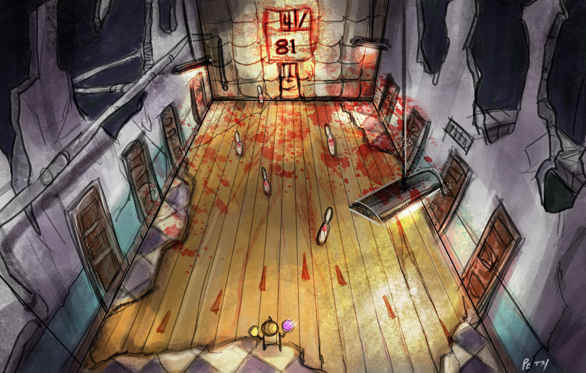

# Dead Balls

A horror bowling game created during the 48-hour [Molyjam](http://www.molyjam.com/) game jam.

## About

Dead Balls is a Unity3D bowling game where players roll balls at animated pins in a spooky atmosphere. The game was inspired by the tweet: *"Imagine survival horror mixed with bowling"* and represents a creative interpretation of combining two seemingly incompatible genres.

Originally released for free on the iOS App Store in 2012.

## Game Jam

- **Event**: Molyjam (What Would Molydeux Do?)
- **Duration**: 48 hours
- **Year**: 2012

## Team

- **Lee Petty** - Concept art, front-end design, programming
- **Drew Skillman** - Programming
- **Patrick Connor** - Programming
- **Bill Gahr** - Programming
- **Alex Vaughan** - Music

## Media

Watch gameplay footage: [Dead Balls on YouTube](https://www.youtube.com/watch?v=717Yon_mQz8)

### Concept Art

**Title Screen**

**The Bowler**

**Bowling Pin Design Sheet**

**Basic Room Environment**

## Links

- [Drew Skillman's Blog Post](https://blog.drewskillman.com/devlog/dead-balls-is-on-the-app-store)
- [Lee Petty's Blog Post](https://leepetty.blogspot.com/2013/06/?m=0)

## Technical Details

This is a legacy Unity project (circa 2012) that has been updated for Unity 2019 compatibility. The original game code and assets remain largely unchanged except where required for modern Unity API compatibility.

## License

Original code by Team Manticore. Unity 2019 migration assistance provided by Claude Code.
